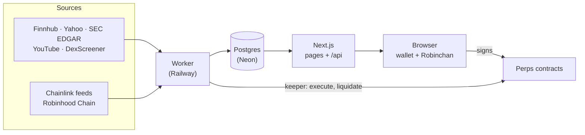

<p align="center">
  
</p>

<h1 align="center">Robinchan</h1>

<p align="center">
  <strong>A Live2D character companion for tokenized stocks on Robinhood Chain.</strong><br />
  Read the market. Talk it through. Sign it yourself.
</p>

<p align="center">
  <a href="https://robinchan.tech">Website</a> ·
  <a href="https://x.com/Rchanperps">X / @Rchanperps</a> ·
  <a href="https://robinhoodchain.blockscout.com/token/0x9ff3f587b9d46b51d92982011e32fcdba4e531f0">$RCHAN on Blockscout</a> ·
  <a href="#quick-start">Quick start</a> ·
  <a href="#documentation">Docs</a>
</p>

<p align="center">
  
  
  
  
  
</p>

---

## What is Robinchan?

Robinhood Chain trades tokenized stocks around the clock, but the tools around them are still built
for a market that closes. Robinchan puts the data, the context and the risk checks in one place, and
puts a character beside you while you use it: **Robinchan**, a Live2D companion who reads prices,
filings and news out loud, explains why something might be moving, and helps you think through a
trade.

- **Non-custodial.** Nothing is ever signed or sent for you. Every order, open and close is signed by
  you, in your own wallet.
- **Numbers come from the server.** Quotes, balances and prices are computed server-side from its own
  data, never taken from what the page sends. Robinchan can only quote figures the app has actually
  given her, and she never gives personal financial advice.
- **Honest about data.** Stale values dim instead of disappearing, providers that aren't configured
  show gray rather than red, and dev fallbacks flag themselves as fake.

## Features

| Page | What it does |
| --- | --- |
| **Home** `/` | The landing page: a live price tape with $RCHAN, a chat demo, the heat board, and the ideas behind the product. Readable without a wallet |
| **Robinchan** `/robinchan` | Full-screen chat with the Live2D companion. Spoken replies (ElevenLabs), four moods (`happy`, `focused`, `alert`, `relaxed`), lip-sync, and replies in the language you write in. The same thread opens from a small avatar on every other page |
| **Market** `/market` | Indices, a tape of tokenized stocks, a news feed with sentiment dots, SEC filings, an earnings calendar, live market broadcasts and highlight clips, and a "sources monitored" card showing the health of every provider |
| **Heat** `/heat` | A 0–100 heat score per symbol from on-chain activity, news and (later) social, with the reasons behind every score. The more $RCHAN you hold, the more of the board and Robinchan's own read you see |
| **Portfolio** `/portfolio` | Your wallet, read from the chain: holdings, cost basis from your filled Robinchan orders or prices you enter, PnL that says what it leaves out, and a value chart |
| **Perps** `/perps` | Perpetual futures on crypto, US stocks, agricultural products and Robinhood Chain's own tokens, priced by Chainlink and settled on-chain. Behind `FEATURE_PERPS` |
| **Gap** `/gap` | Every Robinhood stock token's on-chain price against its real stock, across pre-market, regular hours, after hours, overnight and weekends |
| **Token Check** `/check` | Paste any token address on Robinhood Chain and get a verdict: contract powers, a simulated sell, impersonation checks and where the supply sits. Nothing is signed |
| **Companion, everywhere** | Tap the peeking Robinchan on any page and she tells you, in a sentence or two and in her own voice, what that page shows right now |

### Gap and Token Check in one glance

**Gap** shows what tokenized stocks do when Wall Street is shut. Each row sets the token's
liquidity-weighted on-chain price against the stock's own, with the session clock next to it (regular,
pre-market, after hours, overnight, weekend, NYSE holiday) and 72 hours of history per row.

**Token Check** is a rug-check built for this chain. It reads the contract (owner, proxies, mint,
blacklist, pause and tax powers), then runs a real sell simulation with `eth_simulateV1` on a copy of
the latest block. It also catches look-alikes: a token that borrows "NVIDIA" and "Robinhood" in its
name is flagged as impersonating the official stock token.

### Perps at a glance

| Category | Markets | Max leverage | Price source |
| --- | --- | --- | --- |
| Crypto | BTC, ETH | 20x | Chainlink Data Feeds, 24/7 |
| Stocks | AAPL, TSLA, NVDA, AMZN, GOOGL, MSFT, META, SPCX, SPY, CRCL, MU, GLD | 5x | Chainlink feeds for Robinhood's tokenized stocks, 24/5 |
| Agri | CORN, SOYB, WEAT, COFF, COCC, SUGA, RICE, COTT | 5x | Yahoo Finance quotes posted on chain by Robinchan (about 10 minutes behind), labeled as such on the page |
| RH Tokens | PONS, CASHCAT, DELTA | 5x | The token's own Uniswap V3 pool, as a 15-minute TWAP |

Every order fills at a price the trader could not have seen when they placed it: the first oracle
round *observed* after the request. Full details are in [Perps](#perps-in-depth).

## Status

| Area | State |
| --- | --- |
| Home, Robinchan, Market, Heat, Portfolio, Gap, Token Check | Built and running. Gap and Token Check need no wallet or flag |
| Perps | Contracts are deployed on Robinhood Chain mainnet (`contracts/deployments/4663.json`). The page stays behind `FEATURE_PERPS` until an external audit, a settlement-USDC confirmation and a legal review are done |
| Spot trading from chat | Behind `FEATURE_TRADING`, off by default. Runs on a `paper` venue in dev; the Uniswap V3 adapter is written but hasn't run against a live deployment |
| Voice for chat replies | On for everyone whenever `ELEVENLABS_API_KEY` is set (with a mute toggle); text only otherwise |
| Social heat, streaming chat, buyback logging | Not built yet, see [Roadmap](#roadmap-and-open-decisions) |

## How it works



The **worker** pulls from providers on a schedule and writes to one Postgres database. The **API**
only reads: it never calls a provider while serving a request. Pages stay fast, provider rate limits
stay safe, and when a provider goes down the last known data is still served with a `stale` flag.

The API is served by Next.js route handlers with Zod validation, a `{ data, stale, asOf }` envelope,
CORS, security headers and a 60-requests-per-minute-per-IP limit. Pages render their first paint by
running the same routes in-process, then poll `/api/*` from the browser.

Token Check is the one exception to the read-only rule, since any address can be asked about. It reads
the chain on the request, reuses a result for 2 minutes, runs one check when the same address is asked
twice at once, and allows each IP 10 fresh checks a minute.

## Quick start

Needs Node 20.9+.

```bash
npm install
npm run dev
```

Two processes start together: the Next.js app at `http://localhost:3000` (pages and `/api/*`) and the
worker in the background. The Market page starts filling in within ten seconds.

No `.env` is needed to start. To add keys, create a `.env` at the repo root; the web app and the
worker read the same file, so no value ends up stuck in one process. With no keys at all, storage
falls back to JSON files in `.data/`, providers without a key show gray ("not configured"), and
`RC_ENV` defaults to `dev`, which fills the gaps with data that flags itself as fake.

To populate data once without leaving the worker running:

```bash
npm run once -w @robinchan/worker
```

**Try Perps locally.** Set `FEATURE_PERPS=true` in `.env` and restart. The dev venue is `paper`: the
test-USDC button funds a virtual balance, every open and close is really signed in your wallet, then
filled at the live Chainlink price without moving anything on chain. Prices are read from Robinhood
Chain mainnet with no key needed; if it can't be reached, dev runs on a fixture random walk flagged
as such.

### Configuration

Keys that make the data and the character real:

| Variable | Enables |
| --- | --- |
| `FINNHUB_API_KEY` | Prices, indices, news feed, earnings calendar |
| `SEC_EDGAR_USER_AGENT` | SEC filings (must include a reachable contact) |
| `YOUTUBE_API_KEY` | Active stream per channel and Highlights clips. Without it the page shows a poster and an "Open on YouTube" button rather than a video id that fails silently |
| `MEGALLM_API_KEY` | Robinchan's chat, and the tap-to-read-the-screen feature (OpenAI-compatible; base URL and model are configurable) |
| `ELEVENLABS_API_KEY` | Robinchan's voice. Chat falls back to text when it is empty or out of quota |
| `NEXT_PUBLIC_RCHAN_ADDRESS` | The $RCHAN price from DexScreener, and tiers read from a wallet's balance |
| `DATABASE_URL` | Postgres (see below). Empty means `.data/` files |

Feature flags, all off by default: `FEATURE_PERPS`, `FEATURE_TRADING`, `FEATURE_HEAT_READS` (serve
Robinchan's heat reads to Tier 1) and `FEATURE_SOCIAL_HEAT`. The perps variables are listed under
[Perps in depth](#perps-in-depth).

<details>
<summary><strong>Database: Vercel Postgres (Neon)</strong></summary>

Everything the app stores lives in one Postgres database: news, heat scores and the calendar, plus
the cache (prices, feeds, provider status) and the per-IP rate-limit counters, so there is no Redis.

1. In the Vercel project: **Storage → Create Database → Neon**, connected to the web app. Vercel
   injects `DATABASE_URL` (also exposed as `POSTGRES_URL`) automatically.
2. Put the same pooled `DATABASE_URL` in the worker's environment (Railway), and in the root `.env`
   for local development against it.

The schema (`packages/store/src/schema.ts`) is applied automatically on the first query from the web
app or the worker. There is no migration step to run.

The `.data/` fallback is written by both processes, so writes go through a cross-process file lock
and the cache is one file per domain (`.data/cache/*.json`). It does not work on Vercel, where the
filesystem is read-only.

</details>

### Tests

| Command | What it checks |
| --- | --- |
| `npm run typecheck` / `npm run lint` | Types across all workspaces, and ESLint on the web app |
| `npm test -w @robinchan/core` | Cost basis, the advice guard, the order pipeline (paper venue, real signatures), heat gating, portfolio valuation, the transaction lifecycle against a scripted chain, perps, Gap and Token Check. No network, no database |
| `npm test -w @robinchan/store` | The Postgres implementation on PGlite (Postgres in WASM): the schema upgrading an existing database, and every query the pages use |
| `npx hardhat test` in `contracts/` | Lifecycle, which Chainlink round fills an order, taking orders back, liquidation, funding, delisting, the vault's solvency after every step, the feed adapters (Pyth, reported, TWAP) and the attacks from the security reviews |
| `npm run eval:parse -w @robinchan/core` | Order parsing against the real model: 30 sentences, at least 28 correct or asked back, 0 silent misparses. Needs `MEGALLM_API_KEY` |
| `npx tsx scripts/e2e.mts` | Everything over HTTP with real Sign-In with Ethereum (see the script's header for the flags it expects) |
| `npx tsx scripts/e2e-perps.mts` | Perps over HTTP on either venue: paper, or the contracts on a local chain with the keeper executing orders |
| `npm run reads -w @robinchan/worker` | Prints Robinchan's stored heat reads for review before `FEATURE_HEAT_READS` goes on |

## Project structure

```
apps/
  web/          Next.js 16 (App Router, React 19, Tailwind): Home, Robinchan, Market, Heat,
                Portfolio, Perps, Gap, Token Check, and the API (src/app/api/[...path] → src/server/api)
  worker/       Long-running cron: providers in, database out, plus the perps keeper
packages/
  shared/       Types, constants, market registry, format utils (used by everything)
  store/        Postgres (cache + tables) behind one interface, with the .data/ fallback
  core/         Server-side domain logic shared by web and worker: chain reads (viem), tiers,
                holdings, cost basis, portfolio valuation, the order pipeline, perps (quotes,
                keeper, Chainlink), Token Check, heat gating, and Robinchan's generated reads
contracts/      The perps contracts: a standalone Hardhat 3 project, outside the workspaces
```

**Stack:** Next.js 16, React 19, TypeScript, Tailwind, wagmi 2 + viem, PixiJS + pixi-live2d-display,
Zod, Postgres (Neon; PGlite in tests), Hardhat 3.

### Deployment

| Part | Where | Notes |
| --- | --- | --- |
| `apps/web` (UI + API) | Vercel | Root directory `apps/web`; Neon connected via Storage |
| `apps/worker` | Railway | `SERVICE_TARGET=worker`, same `DATABASE_URL` |
| Database | Vercel Postgres (Neon) | |

The Railway build is code, in [`railway.json`](railway.json): `npm run build` skips itself with
`SERVICE_TARGET=worker` (the worker runs from source on `tsx`), and a push redeploys the worker when
it touches `apps/worker/` or `packages/`.

The worker stays a long-running process on purpose: polling every 20 seconds from a serverless
function would be expensive and flaky. It keeps the Neon compute awake around the clock, so check that
your plan's compute hours cover that. Run one worker.

---

## Deep dives

### Wallet, tiers and Robinchan on every page

- **Wallet and session.** wagmi v2 + viem, injected wallets only (every extension that announces itself
  over EIP-6963). Connecting leads straight into Sign-In with Ethereum: the server checks domain,
  chain, a one-time nonce and the signature, then sets a 24-hour httpOnly session cookie. A wallet that
  reconnects on its own, or an account switched inside the wallet, never pops up a signature by
  itself; it gets a "Sign in" button.
- **Tiers** come from `GET /api/user/tier`: the $RCHAN balance read on chain, cached 60 seconds. Until
  the thresholds are configured, everyone is Free (`source: "unconfigured"`); `RC_DEV_TIER` stands in
  during development only.

  | Tier | Unlocks |
  | --- | --- |
  | Free | Chat, market, the heat board's top 5 (scores rounded), market orders |
  | Tier 1 | Full heat board, watchlist |
  | Tier 2 | Memory, alerts |
  | Tier 3 | Custom personality, limit orders |

- **Four states** in every data block: a skeleton sized like the content, empty with a reason and one
  action, error with a retry, and stale (dimmed, with its last update). With no wallet, Portfolio shows
  the real layout with sample data blurred and the connect button in the middle.
- **Robinchan on every page.** A small avatar bottom-right (not on `/market`, which carries no
  character likeness) opens the same chat thread as `/robinchan`. Each message carries the page and
  symbol; the server looks up what that page shows, at the viewer's own access level, so she can't be
  made to read out anything the viewer couldn't see. Signed in, the thread lives on the server.

### Heat

`GET /api/heat/full` and `GET /api/heat/:symbol` cut the board down on the server. No wallet sees the
top 5 with scores rounded to 10; a wallet sees the top 15 with components; Tier 1 sees everything, the
triggers behind each score, Robinchan's read, and the watchlist filter. Locked rows are sent as
`{ locked, requiredTier }` and nothing else. The weights are 45% on-chain, 35% news and 20% social
(`HEAT_WEIGHT_*`). Social isn't built, so its weight is redistributed to the other two, and it shows as
"not active yet" (reason `belum_aktif`) rather than as zero.

The worker stores each component's inputs, a one-line note, the news ids that drove it and notable
on-chain events, and writes Robinchan's reads for the 20 hottest on the heat schedule. A read is never
generated on the click that opens a row.

### Portfolio

Balances are read from the chain (`RC_TOKENS`, plus every token via `RC_EXPLORER_API` when set;
unsupported tokens get their own section). Cost basis comes only from filled Robinchan orders and
from prices you type in: bought partly elsewhere is marked *partial*, unknown stays empty, and PnL
totals say how many assets they leave out. The value chart is rebuilt from hourly prices for 24h and
from daily snapshots (00:00 UTC, starting the day the wallet is first seen) for longer ranges. It is
never back-filled.

### Spot trading from chat

`/trade?symbol=X` redirects to `/perps?symbol=X`, but the spot order pipeline stays for Robinchan's
chat orders and Portfolio's order history. It is behind `FEATURE_TRADING`.

The chat produces an order intent that goes through `quoteOrder → sign → recordOrder`
(`packages/core/src/orders`). Quotes live 30 seconds, are bound to one address, and their countdown
sits in the sign button. Nothing executes without your signature on that exact order, and values come
from the server's quote, never from the page. Pending transactions are watched by the worker, so an
order finishes correctly after the tab closes; past two minutes the page offers speed-up and cancel;
a second order waits while one is in flight. Limit orders are signed when placed, rest until the
worker sees their price, and Robinchan mentions the fill when you're back.

Venues: `paper` (dev only) and `uniswap-v3` (SwapRouter02 + QuoterV2, with the slippage bound in the
calldata and a deadline wrapped around it).

### Gap and Token Check in depth

**Gap** (`/gap`, the worker's `gap` job every 2 minutes):

- **On chain**: the token's pools from DexScreener, weighted by liquidity, leaving out pools under
  $5K or more than 15% from the median.
- **Stock**: the regular-session price from Yahoo Finance's `spark` endpoint, live while Wall Street is
  open and its last close otherwise. Robinhood Chain's Chainlink feed fills in when Yahoo can't be
  reached. Finnhub isn't used here: its free plan is already spent on the Market strip.
- **The clock**: `usSession` in `packages/shared/src/gap.ts`. Weekend is Friday 20:00 to Sunday 20:00
  New York; NYSE holidays are listed through 2027 and need extending before 2028.
- 42 stock tokens are tracked (`STOCK_TOKENS`, each confirmed on chain). SpaceX (SPCX) is a private
  company and stays off the board. Robinchan's line on the page is written from the numbers, never
  generated. `GET /api/gap` serves the board and `GET /api/gap/:symbol` a row's last 72 hours.

**Token Check** (`/check`, `/check/<address>`; `runTokenCheck` in `packages/core/src/check/`):

- **The contract**: owner (renounced, none, active), EIP-1967 and beacon proxies, minimal-proxy
  clones (EIP-1167, Solady's and EIP-7511's variants), and owner-only powers found as function
  selectors in the bytecode: mint, blacklist, pause, tax changes, wallet limits, a trading switch,
  admin roles.
- **The sell test**: `eth_simulateV1` on a copy of the latest block. Tokens are sent out of the pool
  holding the most of them (a v2/v3 pool, or Uniswap v4's PoolManager) to a fresh address, then sent
  back. A revert or a tax shows in the balances. Nothing is signed.
- **Impersonation**: a token that borrows an official stock ticker plus Robinhood's or the company's
  name is a red flag; the ticker alone is a caution. Look-alikes of $RCHAN, USDG and WETH are flagged.
- **The market and supply**: liquidity, age, buys against sells, and the share in pools, burned, with
  the owner and in the contract itself.

It ends in a verdict (official, no red flags, be careful, high risk, can't tell) and Robinchan's line,
both from rules in `judge.ts`, with every finding's wording checked against the advice guard in the
tests. `GET /api/check/recent` lists the last 12 tokens checked (wallets never go on it), and
`?peek=1` answers only from what has already been checked, so a shared link never makes the server
read the chain. Without an indexer it can't see the top holders or who holds a contract's admin roles.

### Perps in depth

`/perps`: perpetual futures priced by Chainlink Data Feeds on Robinhood Chain and settled in USDC
against a liquidity pool. Every open and close is signed by the trader, and the server computes every
number that reaches a signature or a transaction from its own prices and balances.

A Chainlink feed publishes a new round when its price moves 0.5% or once a day, so the on-chain price
can trail the market by up to 0.5%. That's why crypto stops at 20x: at 50x the lag alone would be a
third of a position's margin. Stocks stop at 5x because they gap over weekends, when their feeds
publish nothing (52 to 57 hours without a round the weekend of 2026-09-19) and nothing can be
liquidated. SOL and ARB are listed but not tradable: Chainlink has no feed for them on Robinhood Chain.
Stocks trade 24/5 (Sunday 20:00 to Friday 20:00 New York), and the feeds report total return value, so
splits and dividends need nothing on chain.

Agri markets have no Chainlink feed on the chain, so Robinchan posts Yahoo Finance quotes to a
`ReportedRoundFeed` per market, and the page says so. RH Tokens are priced by their own pool's
15-minute TWAP (`TwapRoundFeed`, in USD through Chainlink's ETH/USD), are capped at $10k a position,
and trade only while the pool holds $500k; an hour without a fresh average stops the market.

**An order on chain**

1. **Request.** Only while the market's feed is live (a round in the last 25 hours), and with a limit
   the current price meets. It commits the collateral and fee, the pool's reserve for the position's
   maximum profit, and the open interest. A deposit can ride along in the same transaction.
2. **Execute.** The worker's keeper, or anyone, executes it at the feed's first round that was
   *observed* after the request (Chainlink observes a price about 13 seconds before it lands on chain;
   a 2-second margin covers clock drift), on the aggregator it was requested on. The contract checks
   the rounds before it, so exactly one round qualifies: nobody can choose a price, nor fill at one
   already on its way. However late it's executed, the order settles at that round, so waiting buys
   nothing. A fill past the trader's limit cancels and refunds it.
3. **Or take it back.** Before its round lands the trader can ask for a waiting order back, forfeiting
   the opening fee, since the order held the pool's liquidity. A price observed after the ask cancels
   it; one observed before still fills it, so nobody who sees a round early can cancel only the fills
   that go against them.
4. **Or expire.** An order no round priced within 25 hours is released with that proven from the
   feed's history. Anyone can do it and earns the execution fee.
5. **Liquidate.** At 80% loss (price and funding), on the feed's latest round. The liquidator keeps 10%
   of what's left, never less than 0.5% of the collateral, and the trader gets the rest.

An order keeps the terms it was requested under, and so does its position: owner changes reach only new
orders, and every setting has hard bounds. Profit per position is capped at min(9x collateral, size),
which is the reserve set aside at request and what keeps the pool able to pay every open position's
best case. Funding is set by the owner per market, capped at 0.01% of size per hour, accrues per
second, is never retroactive, and is 0 by default. A market whose feed stops for a week can be
delisted by the owner, and after two weeks by anyone: its positions settle at the last price with no
close fee.

**Contracts** (`contracts/`, a standalone Hardhat 3 project kept out of the npm workspaces so the app
never installs the Solidity toolchain):

| Contract | Role |
| --- | --- |
| `AgriFeed` | Market → Chainlink feed proxy, answering as 18-decimal USD. Proves from the feed's own round history which round settles an order (or that none did), pinned to the aggregator the order was requested on |
| `AgriVault` | The USDC: each trader's free and locked collateral, the LP pool and its reserve, protocol fees |
| `AgriPerp` | Orders, positions, funding, liquidation, delisting |

Adapters that make other price sources look like Chainlink rounds live in `contracts/contracts/oracles`:
`ReportedRoundFeed` (operator-posted prices), `TwapRoundFeed` (a DEX pool's TWAP) and `PythRoundFeed`.
`liquidate` is permissionless and takes a batch, so the keeper calls it directly rather than needing a
separate liquidator contract.

```bash
cd contracts && npm install
npx hardhat test                                        # the contract suite
npx hardhat node                                        # a local chain
npx hardhat run scripts/deploy.ts --network localhost   # MockAggregators + MockUSDC locally; prints the .env lines
npm run abi                                             # after changing a contract: ABIs into packages/core
```

Operational scripts in `contracts/scripts/`: `preflight.ts` (check every feed against Chainlink's
directory), `list-markets.ts` and `list-agri-markets.ts`, `set-markets.ts` (pause or change caps),
`delist.ts`, and `pool-liquidity.ts` (show, add to or take from the pool). The step-by-step for
mainnet, including a rehearsal on a copy of it and running markets from a Safe, is
[`contracts/MAINNET.md`](contracts/MAINNET.md).

**API and worker**

- **API** under `/api/perps/`: `markets`, `stats/:symbol`, `price/:symbol`, `candles/:symbol`,
  `positions`, `history`, `orders`, `collateral`, `quote`, `record`, `cancel`, `actions/:id` and
  `faucet` (dev). `/api/rh-tokens` lists the RH Tokens and whether each pool holds the $500k to list.
  Wallet routes need the SIWE session and have per-wallet limits; a quote lives 20 seconds and is
  bound to one address.
- **Worker jobs.** `perp-prices` reads every feed's latest round in one multicall every 5 seconds and
  builds the chart bars. `perp-orders` runs every 3 seconds: the keeper executes orders whose round has
  landed, expires the ones no round priced, and releases the ones asked back. `perps` runs every 5
  seconds: lapsed quotes, transactions in flight, the contract's events mirrored into the database,
  liquidations and delisted markets. `twap-rounds` updates each RH Token's TWAP feed, and `agri-prices`
  posts the agri quotes. Jobs keep running with the flag off while positions are open.
- **The keeper key** (`KEEPER_PRIVATE_KEY`, worker only) calls only permissionless functions. It holds
  gas and the execution fees it earns, never user funds. Without it, orders wait for someone else to
  execute them.
- **RPC.** Chainlink is read over plain RPC: the feeds are public contracts with no key or plan. Robinhood's
  own RPC is blocked by some Indonesian ISPs, so the default `PERPS_ORACLE_RPC_URL` is dRPC's public
  endpoint.

| Variable | Meaning |
| --- | --- |
| `FEATURE_PERPS` | The page and every perps-writing endpoint |
| `PERPS_VENUE` | `paper` (dev only) or `agri-perp` |
| `AGRI_FEED_ADDRESS`, `AGRI_VAULT_ADDRESS`, `AGRI_PERP_ADDRESS`, `AGRI_DEPLOY_BLOCK` | The deployment |
| `PERPS_ORACLE_RPC_URL` | Where prices are read when the contracts aren't on Robinhood Chain (paper, a local chain) |
| `PERPS_ORACLE=mock` | Local chains only: the worker posts cached prices into the MockAggregators |
| `KEEPER_PRIVATE_KEY`, `PERPS_EXECUTION_FEE_WEI` | The keeper, and what each order pays whoever executes it |
| `PERPS_FUNDING_RATES`, `PERPS_FEE_BPS`, `PERPS_CLOSE_FEE_BPS`, `PERPS_MAX_OI_USD`, `PERPS_FAUCET_USDC` | The paper venue's copies of what the contract holds on chain |

<details>
<summary><strong>Where the build differs from the original perps brief</strong></summary>

| Brief | Built | Why |
| --- | --- | --- |
| Pyth price feeds | Chainlink Data Feeds on Robinhood Chain | Pyth's commodity and equity data needs a paid plan; Chainlink's feeds there are free to read |
| 50x on every market | 20x crypto, 5x stocks | The feeds' 0.5% deviation lag, and weekend gaps |
| Open at the current price | Request, then execute at the first round observed after it | Opening at a price the trader has already seen lets them pick a favourable one |
| Nothing | Orders can be asked back | Waiting for a round can take hours |
| 0.1% opening fee | 0.1% to open and 0.1% to close | A free round trip is an option on the pool |
| Uncapped profit | min(9x collateral, size), reserved from the pool | The pool has to cover every position's best case |
| Funding 0.01% per hour | 0 by default, owner-set, capped at 0.01% per hour | 0.01% an hour is about 88% of size a year |
| `GOOG` | `GOOGL` | The rest of the app, and Chainlink, track class A |
| WebSocket price stream | Polling the cached price | No chain read behind a page load |
| `AgriLiquidatorBot` contract | The worker's keeper | `liquidate` is permissionless |

The Pyth version of the contracts is archived in `contracts/archive/pyth/`.

</details>

<details>
<summary><strong>Before mainnet: what an audit still has to cover</strong></summary>

The internal security reviews that shaped the contracts don't replace an external audit. What they
left open, for the audit and for operations:

- Waiting orders hold pool liquidity and open interest until their round. Taking one back costs the
  opening fee, but an order a quiet feed never prices (a stock's weekend) is released free after 25
  hours, so a large enough stack of orders can crowd the pool for a while. The owner can pause markets
  and add liquidity.
- The stock feeds are verified silent on weekends; on US market holidays and trading halts they're
  assumed to be. If one published at a stale price, orders would fill at a price known in advance:
  pause stock markets over a holiday until that's confirmed.
- A price gap wider than the liquidation distance between two rounds (a sequencer outage, a flash
  crash) is paid by the pool, like any perps venue's. There is no sequencer-uptime feed for Robinhood
  Chain yet to pause on.
- In the second a round lands through Chainlink's private SVR path, the contract doesn't see it yet;
  a cancel released in that very second, of an order that round would have filled, needs a
  transmission delayed five minutes as well.
- An order that would need more than 64 in-flight rounds of proof can't settle, which means 64 rounds
  landing within a minute, beyond what a Chainlink network publishes.
- The keeper has to stay live for orders to fill promptly. They settle at their round whenever
  executed, so a slow keeper costs time, not money.

Also open: a minimum execution fee on a real chain (`MIN_EXECUTION_FEE_WEI` at deploy), which USDC to
settle in (the only USDC found on the chain has about 340 in circulation, so this needs Robinhood's
confirmation), the LP seed, the keeper's gas budget, a borrow fee on open interest, and a regulatory
answer for leveraged derivatives on stocks.

</details>

### The Live2D character

Model: [Zundamon](https://www.live2d.com/en/learn/sample/zundamon/), a Live2D Inc. sample model.
Runtime assets live in `apps/web/public/live2d/zundamon/`.

- The model path is read from `NEXT_PUBLIC_LIVE2D_MODEL_URL`, so it can be swapped without changing code.
- The product's expression map (`happy`, `focused`, `alert`, `relaxed`) is kept separate from the
  expression names inside `model3.json`, in `apps/web/src/components/live2d/expressions.ts`. Swapping
  the model means changing just that one table.
- Cubism Core loads from Live2D's official CDN, since the package isn't published on npm.
- The `model3.json` in `public/` has the `EyeBlink` and `LipSync` groups filled in. Live2D ships them
  empty, and without that, auto-blink and lip-sync have nothing to drive.
- Without WebGL, the stage falls back to a static placeholder and the expression buttons are disabled.

**Licensing isn't settled.** The bundled `ReadMe.txt` says commercial use is allowed for individuals
and small businesses under agreed terms, while medium-to-large businesses are limited to non-public
testing. Separately, the Zundamon character has its own usage guidelines from the Tohoku Zunko /
Zundamon Project. Both need confirmation before production (see [`design.md`](design.md) §9). Until
then, treat this asset as a placeholder. A copy of the original notice is at
`apps/web/public/live2d/zundamon/LICENSE-NOTICE.txt`.

---

## Roadmap and open decisions

**Not built yet**

- Token streaming for chat (SSE). The reply and its voice are returned together so they play in sync.
- The social component of the heat score.
- The buyback logging job.
- Real spot execution, which waits on the decisions below. Until then it runs on the `paper` venue in
  dev and stays behind `FEATURE_TRADING`.

**Still open, and what each one blocks**

| Decision | Blocks | Stand-in until then |
| --- | --- | --- |
| Tier thresholds | Real tiers | Everyone Free; `RC_DEV_TIER` in dev |
| Token contracts for tokenized stocks (`RC_TOKENS`) | Real Portfolio balances | Arbitrum Sepolia and a sample wallet in dev |
| DEX and ABI, fee, slippage | Real spot swaps | `paper` venue; `PROTOCOL_FEE_BPS=10` and `DEFAULT_SLIPPAGE_BPS=50` placeholders |
| Limit-order primitive vs a bot | Limit orders on a real venue | Paper limit orders, filled by the worker |
| Regulatory answers | Trading in production | `FEATURE_TRADING=false` |
| Settlement USDC on Robinhood Chain | Perps with real funds | `paper` venue; a local chain with MockAggregators and MockUSDC |
| External audit | Perps in production | `FEATURE_PERPS=false` |

**Technical notes**

- **News sentiment** is a lexicon score (`apps/worker/src/lib/sentiment.ts`). Alpha Vantage News
  Sentiment is planned for a later phase, while the sentiment dots and the heat score's news component
  already need a number now.
- **Heat gating** is decided on the server from the session and the tier read on chain. Home's
  five-row board (`/api/heat`) stays the anonymous view on purpose: it's a cached public page and must
  never render one viewer's data for another.
- **On-chain heat inputs** come from DexScreener for tokens with a configured address. Outside
  `RC_ENV=dev`, a symbol without one has an inactive on-chain component (weight moved to news) rather
  than a made-up number.
- **`npm audit`** leaves findings that can't be closed from here: `pixi-live2d-display` lists
  `gh-pages` as a dependency even though it's its own documentation deploy tool and is never imported
  from `dist/`, and `@railway/cli` (a dev-only deploy tool) pulls an old `tar`.

## Documentation

| Document | What's in it |
| --- | --- |
| [`robinchan-dev-brief.md`](robinchan-dev-brief.md) | The main product brief: pages, data, tiers, milestones |
| [`robinchan-agri-perps-brief.md`](robinchan-agri-perps-brief.md) | The perps brief that replaced the Trade page |
| [`design.md`](design.md) | Design direction: tokens, light and dark themes, motion, the character's role |
| [`contracts/MAINNET.md`](contracts/MAINNET.md) | The runbook for deploying and operating perps on Robinhood Chain mainnet |

---

<p align="center">
  <sub>Robinchan is a market companion, not a financial advisor. Nothing it says is investment advice,
  and a heat score is a reading of market conditions, never a signal to buy or sell.</sub>
</p>
